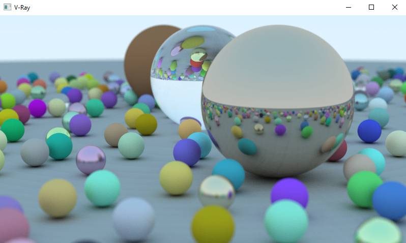

# V Ray

Minimal V RayLib project using VScode, Gcc and Gdb

Note that the image represents the output for the latest commit.  If you want to see how the code follows the Ray Tracing In One Weekend code then check the previous commit to see the changes.

## VSCode Installation & Setup of mingw

Inspirations:
- https://github.com/vlang/v/blob/master/examples/gg/mandelbrot.v 
- https://raytracing.github.io/books/RayTracingInOneWeekend.html
- https://github.com/shovon/raytracing-vlang/blob/main/main.v

That's all folks!
Happy coding!
